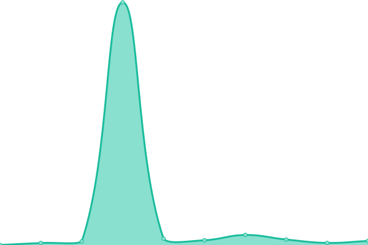

# [📈 Live Status](https://demo.shardacomputers.xyz): <!--live status--> **🟧 Partial outage**

This repository contains the open-source uptime monitor and status page for [Sandip Vishwakarma](https://demo.shardacomputers.xyz), powered by [Upptime](https://github.com/upptime/upptime).

With [Upptime](https://upptime.js.org), you can get your own unlimited and free uptime monitor and status page, powered entirely by a GitHub repository. We use [Issues](https://github.com/Sandip-XDS/imedia/issues) as incident reports, [Actions](https://github.com/Sandip-XDS/imedia/actions) as uptime monitors, and [Pages](https://demo.shardacomputers.xyz) for the status page.

<!--start: status pages-->
<!-- This summary is generated by Upptime (https://github.com/upptime/upptime) -->
<!-- Do not edit this manually, your changes will be overwritten -->
<!-- prettier-ignore -->
| URL | Status | History | Response Time | Uptime |
| --- | ------ | ------- | ------------- | ------ |
|  [Sharda Computers](https://www.shardacomputers.xyz) | 🟥 Down | [sharda-computers.yml](https://github.com/Sandip-XDS/upptime/commits/HEAD/history/sharda-computers.yml) | 

 0ms
     
 | 

<a href="https://demo.shardacomputers.xyz/history/sharda-computers">0.00%</a>
    

|  [IntelliLoop - Admin](https://admin.intelliloop.app) | 🟩 Up | [intelli-loop-admin.yml](https://github.com/Sandip-XDS/upptime/commits/HEAD/history/intelli-loop-admin.yml) | 

 209ms
     
 | 

<a href="https://demo.shardacomputers.xyz/history/intelli-loop-admin">100.00%</a>
    

|  [Thenewstream - Admin](http://admin.thenewstream.com) | 🟥 Down | [thenewstream-admin.yml](https://github.com/Sandip-XDS/upptime/commits/HEAD/history/thenewstream-admin.yml) | 

 1142ms
     
 | 

<a href="https://demo.shardacomputers.xyz/history/thenewstream-admin">93.75%</a>
    

|  [Apolloltms](http://apolloltms.com) | 🟥 Down | [apolloltms.yml](https://github.com/Sandip-XDS/upptime/commits/HEAD/history/apolloltms.yml) | 

 304ms
     
 | 

<a href="https://demo.shardacomputers.xyz/history/apolloltms">0.00%</a>
    

|  [ASCT Systems - asct.systems](http://asct.systems) | 🟥 Down | [asct-systems-asct-systems.yml](https://github.com/Sandip-XDS/upptime/commits/HEAD/history/asct-systems-asct-systems.yml) | 

 0ms
     
 | 

<a href="https://demo.shardacomputers.xyz/history/asct-systems-asct-systems">0.00%</a>
    

|  [Eris - eris.co.in](https://eris.co.in) | 🟥 Down | [eris-eris-co-in.yml](https://github.com/Sandip-XDS/upptime/commits/HEAD/history/eris-eris-co-in.yml) | 

 2025ms
     
 | 

<a href="https://demo.shardacomputers.xyz/history/eris-eris-co-in">6.71%</a>
    

|  [Intelliloop](https://www.intelliloop.app) | 🟥 Down | [intelliloop.yml](https://github.com/Sandip-XDS/upptime/commits/HEAD/history/intelliloop.yml) | 

 0ms
     
 | 

<a href="https://demo.shardacomputers.xyz/history/intelliloop">0.00%</a>
    

|  [Monetizemedia](http://monetizemedia.com) | 🟥 Down | [monetizemedia.yml](https://github.com/Sandip-XDS/upptime/commits/HEAD/history/monetizemedia.yml) | 

 0ms
     
 | 

<a href="https://demo.shardacomputers.xyz/history/monetizemedia">0.00%</a>
    

<!--end: status pages-->

[**Visit our status website →**](https://demo.shardacomputers.xyz)

## 📄 License

- Powered by: [Upptime](https://github.com/upptime/upptime)
- Code: [MIT](./LICENSE) © [Sandip Vishwakarma](https://demo.shardacomputers.xyz)
- Data in the `./history` directory: [Open Database License](https://opendatacommons.org/licenses/odbl/1-0/)
